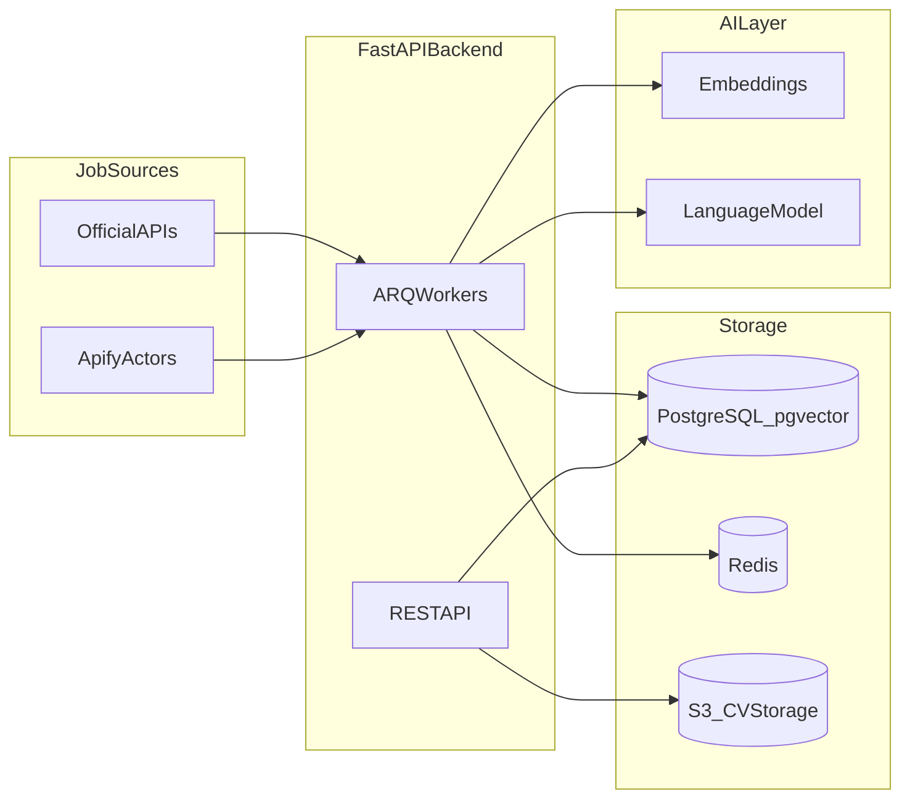

# AI Job Agent Platform

An AI-first job search platform that collects jobs from multiple sources, deduplicates and caches postings, performs semantic matching with embeddings, scores opportunities with AI, generates tailored resumes and cover letters, sends outreach emails, and tracks applications end-to-end.

**Current status:** MVP v1 is implemented and merged to `main` — live-backend frontend (no mock layer), Docker Compose stack, a configurable AI provider (local Ollama / Ollama Cloud / OpenAI, chosen independently for chat and embeddings), active-CV selection, documents + outreach, and basic hardening. After pulling, run `alembic upgrade head` to apply migrations. See [TODO.md](TODO.md).

---

## Table of Contents

- [Overview](#overview)
- [Documentation](#documentation)
- [Current State](#current-state)
- [Core Capabilities](#core-capabilities)
- [System Architecture](#system-architecture)
- [Technology Stack](#technology-stack)
- [Project Structure](#project-structure)
- [Team & Contributing](#team--contributing)
- [Data Model](#data-model)
- [Main Workflows](#main-workflows)
- [Local Development Setup](#local-development-setup)
- [Environment Variables](#environment-variables)
- [Database Migrations](#database-migrations)
- [API Overview](#api-overview)
- [AI Layer](#ai-layer)
- [Scraping and Ingestion](#scraping-and-ingestion)
- [Email Automation](#email-automation)
- [Frontend Overview](#frontend-overview)
- [Deployment](#deployment)
- [Roadmap](#roadmap)
- [License](#license)

---

## Overview

The platform helps users manage the full job-seeking workflow:

1. Discover jobs from official APIs and supplementary scraping sources
2. Normalize, deduplicate, and cache discovered postings in PostgreSQL
3. Generate embeddings and index jobs in pgvector for semantic search
4. Match uploaded CVs to relevant jobs using vector similarity and LLM re-ranking
5. Score jobs, explain fit, and detect possible scams or low-quality postings
6. Generate tailored resume snapshots and cover letters
7. Compose and send outreach emails
8. Surface direct apply links for the most relevant matches (user applies in their own browser)
9. Track application status and outcomes
10. Compute job-search statistics from stored records

The architecture is intentionally simple enough for an MVP, but structured enough to grow into a production-grade system.

---

## Documentation

| Document                                                      | Description                                        |
| ------------------------------------------------------------- | -------------------------------------------------- |
| [System Requirements](docs/system-requirements.md)            | MVP feature checklist and business logic           |
| [Tech Stack](docs/tech-stack.md)                              | Approved technologies                              |
| [Code Architecture](docs/code-architecture.md)                | Layered backend design, AI layer, testing strategy |
| [Data Layer](docs/data-layer.md)                              | ORM models, pgvector, repositories, migrations     |
| [Docker Orchestration](docs/docker-orchestration.md)          | Compose topology, healthchecks, volumes            |
| [Contributing Rules](docs/contributing-rules.md)              | Branch naming, commits, PR workflow                |
| [TODO](TODO.md)                                               | Active tasks by assignee                           |
| [ADR 001: Queue Tool](docs/adr/001-queue-tool.md)             | ARQ + Redis for async workers                      |
| [ADR 002: AI Layer](docs/adr/002-ai-layer-stack.md)           | Embeddings, pgvector, local/API models             |
| [ADR 003: Apply Automation](docs/adr/003-apply-automation.md) | Direct-apply links instead of browser automation   |
| [ADR 004: Jobs Scraping](docs/adr/004-jobs-scraping.md)       | Apify + official APIs, pluggable sources           |

---

## Current State

What exists today versus what the docs describe as the target:

| Area              | Status                                                                                                                                            |
| ----------------- | ------------------------------------------------------------------------------------------------------------------------------------------------- |
| Documentation     | Complete — requirements, architecture, data layer, Docker plan, ADRs                                                                              |
| Backend           | FastAPI app with auth, jobs, searches, CVs, applications APIs; ARQ workers; pytest in CI                                                        |
| Database / models | SQLAlchemy models + Alembic migrations (pgvector)                                                                                               |
| Auth              | `fastapi-users` JWT with `jobagent_auth` cookie                                                                                                   |
| ARQ workers       | Ingestion, CV parse, embedding task stubs wired                                                                                                   |
| Frontend          | Next.js 16 dashboard with live API wiring, Vitest + ESLint in CI                                                                                  |
| Docker / infra    | Compose stack in `infra/docker/`                                                                                                                  |
| Tests             | Backend pytest (Testcontainers); frontend Vitest                                                                                                  |

Next steps: see [TODO.md](TODO.md).

---

## Core Capabilities

Target MVP capabilities (from [system-requirements.md](docs/system-requirements.md)):

- User authentication and account management (JWT)
- CV upload, storage, and active-CV selection
- Job collection from official APIs and Apify-backed sources
- Normalization, deduplication, and caching of repeated postings
- Semantic matching via pgvector embeddings
- AI-based job scoring, explanations, and categorization
- Scam and risk detection with stored flags
- Tailored resume and cover letter generation
- Outreach email drafting and sending (Postmark or Gmail API)
- Application tracking with status pipeline
- Direct apply links for top matches (up to 10 relevant jobs)
- Background processing through ARQ workers
- Dashboard for jobs, applications, outreach, and statistics

---

## System Architecture



## AI Rules

Overview

This repository uses a single source-of-truth file for AI rules that automatically propagates to all supported AI tools on commit. Any contributor using a supported AI editor will receive the same rules without extra configuration, ensuring consistent guidance across the team.

How it works

```
ai-agents/*.md  ──(pre-commit hook)──▶  .github/instructions/*.instructions.md  (Copilot, Claude, Gemini, Hermes, Windsurf)
                ──(native @include)──▶  .cursor/rules/  (Cursor)
```

The repository pre-commit hook scans `ai-agents/` for Markdown files, strips the leading frontmatter from each, and writes generated instruction files into `.github/instructions/`, staging them for commit. The Cursor client reads rules directly using a native `@include` directive that references files in `ai-agents/`, so Cursor consumers get the rules without creating copies.

Supported tools and where they read rules from

| Tool                             | Reads from                               | How                                                          |
| -------------------------------- | ---------------------------------------- | ------------------------------------------------------------ |
| Cursor                           | `.cursor/rules/global-rules.mdc`         | `@include` directive, reads `ai-agents/` directly, zero-copy |
| GitHub Copilot                   | `.github/instructions/*.instructions.md` | native instructions folder, auto-applied to all files        |
| Claude (claude.ai / Claude Code) | `.github/instructions/*.instructions.md` | same as Copilot                                              |
| Gemini                           | `.github/instructions/*.instructions.md` | same as Copilot                                              |
| Hermes                           | `.github/instructions/*.instructions.md` | same as Copilot                                              |
| Windsurf                         | `.github/instructions/*.instructions.md` | same as Copilot                                              |

How to add or update rules

1. Edit or add a `.md` file inside `ai-agents/` — this is the only place you should ever edit rules
2. Run `git commit` as normal — the pre-commit hook fires automatically
3. The hook syncs every `ai-agents/*.md` into `.github/instructions/*.instructions.md` and stages the results
4. Push — CI will verify the sync is correct on your PR
5. Never edit `.github/instructions/` files directly — they are generated and will be overwritten

Where to put rules for your specific tool

If you use Copilot / Claude / Gemini / Hermes / Windsurf — where do I put my rules?

Answer: edit `ai-agents/global-rules.md` or add a new `ai-agents/<topic>.md` file. Your tool picks it up automatically via `.github/instructions/`.

If you use Cursor — where do I put my rules?

Answer: same place — `ai-agents/`. Cursor reads it directly via `@include`, no copy needed.

Can I add a tool-specific file?

Answer: yes — add `ai-agents/<toolname>.md` and the hook will create `.github/instructions/<toolname>.instructions.md` automatically on next commit.

One-time setup (for new contributors)

```
git clone <repo-url>
cd <repo-name>
npm install
```

That's it — npm install activates the pre-commit hook and chmod via the prepare script. No other setup required.

CI enforcement

Every pull request that touches `ai-agents/` or `.github/instructions/` triggers a GitHub Actions workflow that diffs the source and generated files. If any generated instruction file is out of sync with its source, the workflow fails the PR and instructs contributors to run `git commit` locally so the pre-commit hook can update the generated files.

Bypassing the hook (not recommended)

If you use git commit --no-verify, the sync will not run. The CI check will catch this and fail your PR.

---

## Technology Stack

| Layer           | Technologies                                                                    |
| --------------- | ------------------------------------------------------------------------------- |
| Frontend        | Next.js, TypeScript, Tailwind CSS                                               |
| Backend         | FastAPI, Python, Pydantic, SQLAlchemy, Alembic, fastapi-users (JWT)             |
| Database        | PostgreSQL + pgvector                                                           |
| Queue / cache   | ARQ, Redis                                                                      |
| Scraping        | Apify (Indeed, LinkedIn) + official APIs (Adzuna, Jooble, Careerjet, regional)  |
| AI (local)      | Ollama — `nomic-embed-text`, `gemma3:4b`                                        |
| AI (cloud/BYOK) | Ollama Cloud (chat) and/or OpenAI (`text-embedding-3-small`, `gpt-4o-mini`) — chat and embeddings configured independently |
| Email           | Postmark or Gmail API                                                           |
| CV storage      | S3                                                                              |
| Infra           | Docker                                                                          |

Full details: [tech-stack.md](docs/tech-stack.md).

---

## Project Structure

Monorepo layout (backend, frontend, and infra are all implemented):

```text
job-agent/
├── backend/
│   ├── alembic/versions/        # migrations
│   ├── app/
│   │   ├── api/v1/routes/       # auth, cvs, jobs, searches, applications, documents, outreach
│   │   ├── core/                # config, db, security, logger
│   │   ├── integrations/        # S3, Apify, AI clients, Postmark, job sources
│   │   ├── middleware/          # auth rate limiting
│   │   ├── models/              # SQLAlchemy ORM
│   │   ├── repositories/        # data access layer
│   │   ├── schemas/             # Pydantic DTOs
│   │   ├── services/            # business logic (matching, ingestion, documents, outreach)
│   │   ├── workers/             # ARQ tasks
│   │   └── main.py              # FastAPI entry + /health
│   ├── tests/                   # pytest (Testcontainers + moto)
│   └── pyproject.toml
├── docs/                        # requirements, architecture, data layer, ADRs
├── frontend/                    # Next.js 16 App Router (TypeScript, Tailwind v4)
│   └── src/
│       ├── app/(auth)/          # login, register
│       ├── app/(dashboard)/     # dashboard, jobs, cvs, applications, documents, outreach, settings
│       ├── components/          # shared UI, layout, brand
│       ├── features/auth/       # auth context + hooks
│       ├── lib/api/             # typed API client (one module per resource)
│       └── test/                # Vitest setup
├── infra/
│   └── docker/                  # Compose stack (Postgres, Redis, MinIO, Ollama, API, worker)
├── ai-agents/                   # single-source AI rules (synced to .github/instructions/)
├── .env.example
└── README.md
```

---

## Team & Contributing

**Core developers:** Pukakiii, Kyryll

Work is split in [TODO.md](TODO.md):

Before opening a PR, read [contributing-rules.md](docs/contributing-rules.md) (branch naming, commit prefixes, rebase with `main`).

Guidelines:

- Keep services focused; business logic lives in `services/`, not route handlers
- Long-running work goes through ARQ workers, not request handlers
- Add Alembic migrations for every schema change
- Record significant architecture changes as ADRs in `docs/adr/`
- Do not introduce technologies rejected in ADRs (e.g. Playwright for apply automation)

### Terms of joining the team

This project is for people who want **real experience working on a team** and **building a production-shaped product** — reading specs, following architecture, writing reviewable code, and shipping incrementally. If you are a _vibecoder_ (copy-paste without understanding docs, skip conventions, or treat the repo as a playground for unrelated experiments), this is not the right fit. **Please note that all contributor roles are voluntary. The project does not currently offer financial compensation, salaries, or contractor payments.**

**How to join**

1. **Read the docs first.** Work through [docs/](docs/) — especially [contributing-rules.md](docs/contributing-rules.md), [system-requirements.md](docs/system-requirements.md), [code-architecture.md](docs/code-architecture.md), and the [ADRs](docs/adr/). Skim the [project structure](#project-structure) and [current state](#current-state) so you know what is implemented versus planned.
2. **Pick a task.** Choose one open item from your role section in [TODO.md](TODO.md) (see [team roles](ai-agents/roles.md)). Tasks are scoped for contributors and align with the MVP foundation.
3. **Open a pull request.** Follow branch naming, commit prefixes, and the PR workflow in [contributing-rules.md](docs/contributing-rules.md). Rebase on `main`, keep the change focused, and explain what you did and why.
4. **Team review.** Core developers review your PR. We check that the work matches the docs (architecture, ADRs, conventions) and that the feature, fix, or contribution is **effective** — correct, maintainable, and useful to the project.
5. **Join the team.** If the review passes, you are welcomed as a contributor with an ongoing role. If not, you are welcome to address feedback and try again with the same or another task.

Questions before you start? Open an issue or note your intent on the task you plan to take.

---

## Data Model

Core tables: `users`, `cvs`, `jobs`, `searches`, `search_results`, `job_applications`, `generated_documents`, `outreach_emails`. Jobs are shared corpus entities; per-user relevance lives on the search-result join. Full ERD, indexes, and repository patterns: [data-layer.md](docs/data-layer.md).

---

## Main Workflows

### 1. Job ingestion

```text
Official APIs / Apify → ARQ workers → normalize → deduplicate → jobs
```

### 2. Embedding and indexing

```text
New job → embed → pgvector → AI analysis → persisted results
```

### 3. Semantic matching

```text
CV upload → parse profile → embed → similarity search → LLM re-rank → ranked jobs
```

### 4. Resume, cover letter, and email generation

```text
Job + CV → AI generation → stored snapshot
```

### 5. Apply and track

```text
Top matches → direct apply links → user applies → application record → status pipeline
```

Application statuses: `saved`, `applied`, `interview`, `offer`, `rejected`.

---

## Local Development Setup

### Prerequisites

- Python 3.11+
- Node.js 20+
- PostgreSQL 15+ with pgvector (or Docker Compose — recommended)
- Redis
- Docker (recommended for full stack)
- Git

### Docker Compose (recommended)

```bash
cp infra/secret/.env.backend.example infra/secret/.env.backend   # set SECRET_KEY; choose AI provider
cd infra/docker

# Fully-local AI (also runs Ollama and pulls models):
docker compose --profile local-ai up -d
# ...or cloud AI (Ollama Cloud / OpenAI) — lighter, no local model container:
#   docker compose up -d

# Create the tables once (after first boot):
docker compose run --rm api alembic upgrade head
```

Services: Postgres (pgvector), Redis, MinIO, API (`:8000`), worker — plus Ollama when `--profile local-ai` is used.

See [docker-orchestration.md](docs/docker-orchestration.md).

### Backend (local Python, without Docker)

```bash
cd backend
python -m venv venv
source venv/bin/activate
pip install -e ".[dev]"
# Ensure root .env exists (copy from .env.example) and Postgres/Redis/MinIO are reachable
uvicorn app.main:app --reload
```

Health check: `GET http://localhost:8000/health`

### Frontend

```bash
cd frontend
cp .env.example .env.local
npm ci
npm run dev
```

Dev server: `http://localhost:3000` — requires the backend at `http://localhost:8000`.

---

## Environment Variables

Two env files serve different contexts:

| File | Used by | Purpose |
|------|---------|---------|
| [`.env.example`](.env.example) → `.env` at repo root | Local `uvicorn` / `pytest` via [config.py](backend/app/core/config.py) | Pydantic `Settings` — DB, Redis, S3, AI keys |
| [`infra/secret/.env.backend.example`](infra/secret/.env.backend.example) → `infra/secret/.env.backend` | Docker Compose `api` and `worker` services | Injected into containers; overrides hostnames (`postgres`, `minio`, `ollama`) |

OS environment variables take precedence over file values. Compose `environment:` block overrides `env_file` for service-specific hostnames.

Copy and adjust:

```bash
cp .env.example .env
cp infra/secret/.env.backend.example infra/secret/.env.backend
```

Key variables (see `.env.example` for the full list):

```env
POSTGRES_USER=postgres
POSTGRES_PASSWORD=password
POSTGRES_DB=job_agent
SECRET_KEY=change-me
REDIS_URL=redis://localhost:6379
CHAT_PROVIDER=ollama      # ollama | openai
EMBED_PROVIDER=ollama     # ollama | openai
OLLAMA_BASE_URL=http://localhost:11434   # https://ollama.com for Ollama Cloud
OLLAMA_API_KEY=           # required for Ollama Cloud
OPENAI_API_KEY=           # required if CHAT_PROVIDER/EMBED_PROVIDER = openai
S3_ENDPOINT_URL=http://localhost:9000
FRONTEND_URL=http://localhost:3000
```

Frontend: copy `frontend/.env.example` to `frontend/.env.local` with `NEXT_PUBLIC_API_URL=http://localhost:8000`.

---

## Database Migrations

Use Alembic for all schema changes. Migrations run as a one-off command — not on app startup.

```bash
cd backend
alembic revision --autogenerate -m "describe change"
alembic upgrade head
```

Rules: never edit production schema directly; keep migrations small; test locally before deploy.

---

## API Overview

REST surface under `/api/v1`. **Implemented:** auth, CVs (incl. active-CV), jobs, searches, applications, documents, outreach (see OpenAPI at `/docs` when the API is running).

| Domain       | Endpoints                                        |
| ------------ | ------------------------------------------------ |
| Auth         | register, login, logout (`fastapi-users` JWT)    |
| CVs          | upload, list, presigned download, set active     |
| Searches     | trigger match, list, detail (embedded results)   |
| Jobs         | list, detail (with direct apply URL), ingest     |
| Applications | CRUD + status transitions                        |
| Documents    | generate resume / cover letter, list             |
| Outreach     | draft, send, list                                |

Scam/risk scoring is on the roadmap and not yet exposed as an endpoint.

Conventions: plural resource nouns, paginated lists, consistent error envelope — [code-architecture.md](docs/code-architecture.md).

---

## AI Layer

Two phases per [ADR 002](docs/adr/002-ai-layer-stack.md):

**Ingestion** — embed job corpus (`nomic-embed-text` / `text-embedding-3-small`), store in pgvector, run analysis workers.

**Query** — parse CV → embed with `search_query:` prefix → cosine similarity → LLM re-rank → fit explanations.

Chat and embeddings are configured independently (`CHAT_PROVIDER` / `EMBED_PROVIDER`): fully-local Ollama by default, or mix Ollama Cloud chat with local/OpenAI embeddings, or OpenAI for both. 768-dim vectors throughout (Ollama Cloud has no embedding models, so cloud chat pairs with local or OpenAI embeddings). See [`infra/secret/.env.backend.example`](infra/secret/.env.backend.example).

---

## Scraping and Ingestion

Pluggable `JobSource` interface. Official APIs are primary; Apify supplements boards without sanctioned APIs. API source wins on duplicate. All ingestion runs via ARQ — [ADR 004](docs/adr/004-jobs-scraping.md).

---

## Email Automation

AI-assisted drafting via Postmark or Gmail API. Emails are separate from application records (one job can have multiple outreach messages). Statuses: `draft`, `sent`, `failed`.

---

## Frontend Overview

Next.js 16 App Router (`src/` directory), TypeScript, Tailwind CSS v4. The dashboard is built and wired to the live backend, with route groups for unauthenticated (`(auth)`) and authenticated (`(dashboard)`) areas. API calls go through `src/lib/api/` (one typed module per backend resource) and hit `/api/v1/*` same-origin via a Next.js rewrite — there is no mock layer at runtime. Pages are thin: they compose feature components and call typed API helpers.

**Routes:** login, register, dashboard, jobs, CVs, applications, documents, outreach, settings.

**Conventions:** job matches with scores and explanations, CV management, document generation, applications Kanban, outreach. Fetches from FastAPI only — no direct DB access. Surfaces direct apply links; no server-side browser automation — [ADR 003](docs/adr/003-apply-automation.md).

Full folder layout: [code-architecture.md](docs/code-architecture.md#frontend-folder-structure).

---

## Deployment

Target topology (Docker): API + worker containers, managed PostgreSQL/pgvector, Redis, Next.js frontend, S3 for CVs, Ollama or BYOK AI, external Apify/Postmark. Full plan: [docker-orchestration.md](docs/docker-orchestration.md).

Recommended order: database + Redis → migrations → API → workers → frontend → S3 → AI/email/scraping credentials.

---

## Roadmap

### Phase 1: Foundation _(done)_

- Backend skeleton, config, layered structure
- Core tables and Alembic migrations
- Docker Compose local stack
- User authentication (JWT)
- ~~Next.js init~~ — done; app shell (route groups, layouts, auth pages)

### Phase 2: Ingestion and embeddings _(done)_

- Pluggable job sources
- ARQ workers for async ingestion
- pgvector index and embedding pipeline

### Phase 3: AI matching and analysis _(matching + explanations done; scam checks pending)_

- CV upload and S3 storage
- Semantic search and LLM re-ranking
- Scoring, explanations, scam checks

### Phase 4: Generation and outreach _(done)_

- Resume and cover letter generation
- Email generation and sending

### Phase 5: UI and tracking _(done)_

- Dashboard, job detail, Kanban board
- Application pipeline and statistics

### Phase 6: Hardening _(in progress)_

- Validation, logging, rate limiting, test coverage, production deploy polish

---

## License

Job Agent is **source-available**, licensed under the
[PolyForm Noncommercial License 1.0.0](https://polyformproject.org/licenses/noncommercial/1.0.0).
Free to use, modify, and share for any **noncommercial** purpose (personal, study,
research, nonprofit/educational/government). **Commercial use is reserved** and requires
a separate license from the copyright holder.
Copyright © 2026 Igor Pukaki. All commercial rights reserved. See the LICENSE file.
