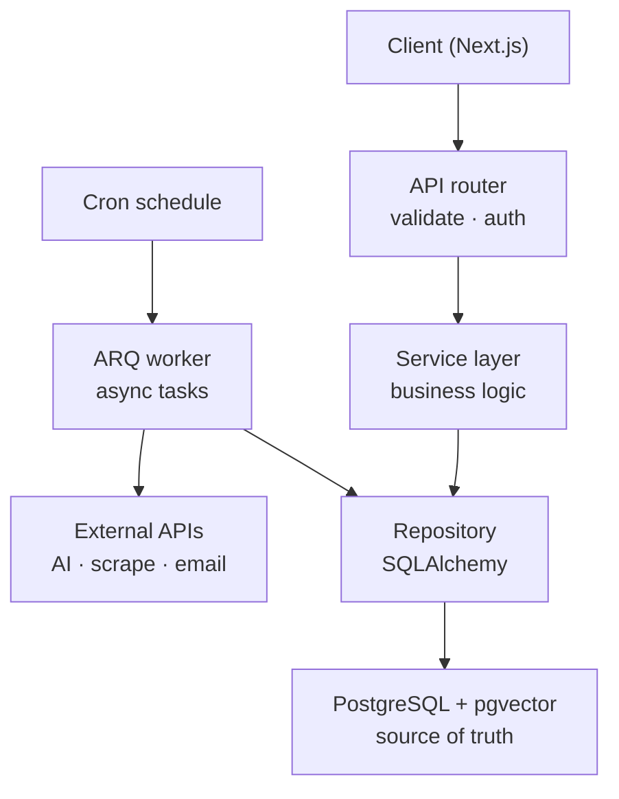

# Code Architecture 

This file provides a full documentation of the code architecture in this project, along with other crucial aspects of ensuring scalable and maintainable codebase. 

## Folder Structure

### Backend

```
backend/
├── app/
│   ├── main.py                 # app factory + lifespan (redis pool, db engine)
│   ├── core/
│   │   ├── config.py           # Settings via pydantic-settings (reads env)
│   │   ├── db.py               # async engine + session factory
│   │   └── security.py         # JWT helpers (mostly delegated to fastapi-users)
│   ├── api/
│   │   ├── deps.py             # shared dependencies: get_db, current_active_user
│   │   └── v1/
│   │       ├── router.py       # aggregates all v1 sub-routers
│   │       └── routes/
│   │           ├── auth.py     # fastapi-users routes (register, login, JWT)
│   │           ├── cv.py       # CV upload + S3 storage
│   │           ├── searches.py # trigger a match, retrieve past searches
│   │           └── jobs.py     # retrieve job details / direct links
│   ├── models/                 # SQLAlchemy ORM table definitions
│   │   ├── user.py
│   │   ├── job.py
│   │   └── search.py
│   ├── schemas/                # Pydantic request/response models
│   │   ├── cv.py
│   │   ├── job.py
│   │   └── search.py
│   ├── repositories/           # DB access — the only place with SQL / ORM queries
│   │   ├── job_repo.py
│   │   └── search_repo.py
│   ├── services/               # business logic / orchestration
│   │   ├── cv_service.py       # parse, validate, persist CV
│   │   ├── matching_service.py # embed → vector search → LLM re-rank
│   │   └── ingestion_service.py# scrape → normalise → embed → store
│   ├── integrations/           # thin wrappers around third-party clients
│   │   ├── openai_client.py    # embeddings + chat completions
│   │   ├── apify_client.py     # triggers scraping actors
│   │   ├── s3.py               # CV upload / presigned URL
│   │   └── postmark.py         # transactional email
│   └── workers/                # ARQ background workers (separate process)
│       ├── settings.py         # WorkerSettings: redis url, task list, cron
│       └── tasks.py            # scrape_board, embed_jobs, send_followup_email
├── alembic/                    # DB migrations
│   └── versions/
├── tests/
│   ├── conftest.py             # fixtures, dependency overrides
│   ├── test_matching.py
│   └── test_ingestion.py
└── pyproject.toml
```
 
The split between `services/` and `workers/` matters here: ingestion logic lives in `ingestion_service.py` so it can be called from a cron-triggered worker *and* tested directly. `workers/tasks.py` is just the thin ARQ entry point that delegates into it.

### Frontend folder structure

Next.js App Router with a `src/` directory. Route groups `(auth)` and `(dashboard)` separate public auth pages from the authenticated shell without affecting URLs. **Bold** = planned file, not yet created.

```
frontend/
├── public/
│
├── src/
│   ├── app/
│   │   ├── (auth)/
│   │   │   ├── login/
│   │   │   └── register/
│   │   │
│   │   ├── (dashboard)/
│   │   │   ├── dashboard/
│   │   │   ├── jobs/
│   │   │   ├── cvs/
│   │   │   ├── applications/
│   │   │   ├── documents/
│   │   │   ├── outreach/
│   │   │   └── settings/
│   │   │
│   │   ├── layout.tsx
│   │   ├── page.tsx
│   │   ├── globals.css
│   │   └── **not-found.tsx**
│   │
│   ├── components/              # shared, domain-agnostic UI
│   │   ├── ui/
│   │   ├── layout/
│   │   └── forms/
│   │
│   ├── features/                # vertical slices — components, hooks, helpers per domain
│   │   ├── auth/
│   │   ├── jobs/
│   │   ├── cvs/
│   │   ├── applications/
│   │   ├── analysis/            # AI scores, fit explanations, scam flags
│   │   ├── documents/           # resume & cover letter generation
│   │   ├── outreach/
│   │   ├── dashboard/
│   │   └── settings/
│   │
│   ├── hooks/                   # shared React hooks
│   │
│   ├── lib/
│   │   ├── api/                 # typed fetch wrappers — one file per API resource
│   │   │   ├── client.ts        # base URL, auth header, error envelope (stub)
│   │   │   ├── auth.ts          # (stub)
│   │   │   ├── jobs.ts          # (stub)
│   │   │   ├── cvs.ts           # (stub)
│   │   │   ├── **searches.ts**  # semantic match trigger & history
│   │   │   ├── applications.ts  # (stub)
│   │   │   ├── documents.ts     # (stub)
│   │   │   └── outreach.ts      # (stub)
│   │   │
│   │   ├── utils/
│   │   └── constants/
│   │
│   ├── types/                   # shared TypeScript types mirroring API schemas
│   │   ├── **api.ts**           # error envelope, pagination
│   │   ├── **auth.ts**
│   │   ├── **jobs.ts**
│   │   ├── **cvs.ts**
│   │   ├── **applications.ts**
│   │   ├── **analysis.ts**
│   │   ├── **documents.ts**
│   │   ├── **outreach.ts**
│   │   └── **dashboard.ts**
│   │
│   ├── test/                   # Vitest setup (MSW removed — tests stub fetch directly)
│   │
│   └── styles/
│
├── **.env.local**
├── next.config.ts
├── package.json
├── tsconfig.json
├── eslint.config.mjs
└── postcss.config.mjs           # Tailwind v4
```

**Layering.** `app/` pages stay thin: layout, data fetching at the route boundary, compose from `features/`. `features/<domain>/` owns domain UI and local state; it calls `lib/api/<resource>.ts` and imports types from `types/`. `components/` holds reusable primitives only — if a component is used by one domain, it belongs in that feature folder.

**API client.** `lib/api/client.ts` centralises the backend base URL, JWT attachment, and the `{"error": {"code", "message"}}` envelope from the backend error-handling section. Domain modules (`jobs.ts`, `cvs.ts`, …) expose typed functions; pages and features never call `fetch` directly.

## The layers
 
- **Router (API layer)** - thin endpoint functions decorated with `@router.post(...)`. Their only jobs: declare the URL, declare the request/response shape (Pydantic schema), pull dependencies via `Depends()`, call one service method, return the result. If you find business logic — a similarity search, a loop over jobs — inside a router, it belongs in the service instead.
 
- **Schemas (Pydantic DTOs)** - define the data shape *crossing the API boundary*: `CVUploadResponse`, `JobMatch`, `SearchCreate`. These are **not** the database models. Keeping them separate means the public API contract and the DB tables can evolve independently — you can add an internal column without leaking it to the frontend.
 
- **Service (business logic)** - where the application actually lives. A `MatchingService.find_matches(cv, prompt)` orchestrates:
parse the CV → extract a structured profile (OpenAI, validated by Pydantic) → embed it → ask the repository for nearest job vectors → re-rank with the LLM and generate fit explanations → return `list[JobMatch]`. Services do not know they are being called over HTTP, and they do not write SQL — they call repositories and integration clients.
 
- **Repository (data access)** - functions that own the SQLAlchemy queries: `search_jobs_by_vector(embedding, limit)`, `save_search(...)`. Isolating this layer lets you tune a `pgvector` query without touching matching logic, and it is the seam where you mock the database in tests.
 
- **Models (SQLAlchemy ORM)** - the table definitions — `User`, `Job`, `Search` — and Postgres with the `pgvector` extension as the source of truth.
 
## Dependencies Flow

Requests flow *downward* through layers, and each layer only talks to the one directly below it. A router never touches the database; a service never touches an HTTP request object. This separation makes the codebase testable and lets you swap pieces — change the LLM provider, replace ARQ with another queue — without rewriting everything.
 
This application has two entry paths sharing a single persistence layer:
 
- **Request path** — a user submits a CV and a prompt; the API validates it, a service orchestrates the AI pipeline, results come back within the same request.
- **Background path** — scraping, embedding the job corpus, and sending follow-up emails run in an ARQ worker outside the HTTP request so users never wait on them.



## Error handling & domain exceptions
 
Services must stay HTTP-agnostic, so they cannot raise `HTTPException`. Instead they raise **domain exceptions**, and a small set of handlers at the edge translate those into HTTP responses with a consistent envelope.
 
```python
# app/exceptions.py
class AppError(Exception):
    status_code = 400
    code = "app_error"
    def __init__(self, message: str): self.message = message
 
class CVNotFound(AppError):        status_code = 404; code = "cv_not_found"
class NoMatchesFound(AppError):    status_code = 404; code = "no_matches"
class SourceUnavailable(AppError): status_code = 503; code = "source_unavailable"
class LLMOutputInvalid(AppError):  status_code = 502; code = "llm_output_invalid"
```
 
```python
# app/api/errors.py
def register_error_handlers(app: FastAPI):
    @app.exception_handler(AppError)
    async def handle_app_error(request, exc: AppError):
        return JSONResponse(
            status_code=exc.status_code,
            content={"error": {"code": exc.code, "message": exc.message}},
        )
```
 
This gives every error the same shape (`{"error": {"code", "message"}}`), keeps HTTP knowledge out of services, and lets the frontend branch on a stable `code` rather than parsing prose. Pydantic validation failures are handled by FastAPI automatically as `422` — you can override that handler to match the same envelope. Never let raw stack traces or third-party exception messages reach the client; map them to a generic `500` and log the detail server-side.
 
## The AI layer in code
 
Per ADR-002 the AI layer is plain code over a thin client — no orchestration framework. **As of this revision the models run locally via Ollama** — `gemma3:4b` for chat (structured extraction + re-ranking) and `nomic-embed-text` for embeddings — instead of OpenAI's hosted models. The layered design makes this a contained change: only the integration client and the embedding dimension move; routers, services, and the rest of the pipeline are untouched. That is the payoff of keeping the AI layer behind a seam.
 
**The client.** Ollama exposes an OpenAI-compatible endpoint, so the existing `openai` SDK can point at it (`base_url="http://ollama:11434/v1"`) — or use the native `ollama` Python client. Either way the `AILayer` interface (`embed`, `extract_profile`, `rank_and_explain`) is unchanged, which is exactly why the swap doesn't ripple upward.
 
**Structured extraction.** Ollama constrains output to a JSON schema via the `format` parameter, so the Pydantic-validated profile still works:
 
```python
async def extract_profile(self, cv_text: str) -> CVProfile:
    resp = await self.client.chat(
        model="gemma3:4b",
        messages=[{"role": "system", "content": EXTRACTION_PROMPT},
                  {"role": "user", "content": cv_text}],
        format=CVProfile.model_json_schema(),   # constrain output to the schema
    )
    return CVProfile.model_validate_json(resp.message.content)
```
 
A candid note worth carrying into the build: `gemma3:4b` is a small (4B-parameter) model. It will obey a constrained schema, but extraction accuracy and re-ranking nuance are lower than a frontier hosted model. So the validate-and-retry guard matters more here, keep the schema flat and unambiguous, and consider a short few-shot example in the prompt. The architecture absorbs the swap cleanly — but match quality is a property of the model, not of the layering.
 
**Embeddings.** `nomic-embed-text` produces **768-dimensional** vectors (vs 1536 for `text-embedding-3-small`) — the persistence column dimension must change to match, which is a change for the data-layer doc. It also expects task-instruction prefixes: prepend `search_document:` to job text on ingest and `search_query:` to the profile text on search. Using the wrong prefix (or none) quietly degrades retrieval, so apply it inside the `AILayer`, consistently on both the ingest and query sides.
 
Treat the model's output strictly as data — validated against a Pydantic schema, never `eval`'d, never interpolated into a query, never used to trigger a privileged action.

## The synchronous / async split
 
The rule for what goes in the request vs the worker is **bounded latency**.
 
**Stays in the request** — a query-time match: parse one CV, one vector similarity search, one LLM re-rank. This is a few seconds end-to-end and can be awaited directly. (On a local 4B model the re-rank is slower than a hosted API, so the in-request budget is tighter — keep this path lean.)
 
**Goes to the worker** — scraping an entire board through Apify, embedding thousands of job postings, sending follow-up emails. This is unbounded and would time out the HTTP request.
 
```python
# Enqueue and return immediately — the heavy work runs in the background
await arq_redis.enqueue_job("scrape_board", source="adzuna", query="python berlin")
# Endpoint returns 202 Accepted; the ARQ worker picks it up asynchronously
```
 
```python
# app/workers/tasks.py
async def scrape_board(ctx, source: str, query: str):
    ingestion: IngestionService = ctx["ingestion_service"]
    await ingestion.run(source=source, query=query)
 
async def send_followup_email(ctx, user_id: str, search_id: str):
    await ctx["postmark"].send_followup(user_id, search_id)
```
 
```python
# app/workers/settings.py
class WorkerSettings:
    redis_settings = RedisSettings.from_dsn(settings.REDIS_URL)
    functions      = [scrape_board, send_followup_email, embed_jobs]
    cron_jobs      = [cron(scrape_board, hour=3, minute=0)]   # nightly corpus refresh
    on_startup     = startup        # wires services into ctx dict
    on_shutdown    = shutdown
```
 
The worker runs as a separate process / container but imports the same `services/` and `integrations/` code. It is launched with `arq app.workers.settings.WorkerSettings`, not uvicorn.
 
### Async correctness pitfalls
 
The async trap that doesn't show up in tutorials and causes production stalls: **never run blocking or CPU-bound work directly in an `async def`.** CV text extraction (parsing a PDF/DOCX) is blocking and will freeze the entire event loop while it runs, stalling *all* concurrent requests. Wrap it — `await anyio.to_thread.run_sync(extract_text, file_bytes)` — or push it into a worker entirely. The same applies to any sync SDK that doesn't offer an `await`able call.
 
> Async concerns that are specific to the data layer — one session per task, connection-pool sizing, and using a fully async driver — are covered in the data-layer doc.

## Resilience: timeouts, retries, idempotency
 
This app's value depends on a few unreliable dependencies — the scraper (Apify), email (Postmark), and the local model server (Ollama) — that will all, eventually, time out, fail, or saturate. Resilience is a first-class architectural concern, not an afterthought.
 
**Timeouts on every external call.** Never use a client's default (often unbounded) timeout — a hung Apify run would otherwise tie up a worker forever. Set explicit per-call timeouts.
 
**Retry transient failures with backoff.** Use `tenacity` to retry on `5xx`, connection errors, and timeouts with exponential backoff; never retry `4xx` validation errors (they'll just fail again). Ollama has no vendor rate limit, but it serializes work (`OLLAMA_NUM_PARALLEL`) and inference is CPU/GPU-bound on your own hardware — so expect backpressure under load and a slow first call while a model loads into memory, rather than `429`s.
 
**Idempotency, because ARQ delivers at-least-once.** A task can run more than once (a retry after a crash mid-execution). Tasks must therefore be safe to repeat:
 
- `scrape_board` re-running must not create duplicate jobs → skip listings already ingested (upsert by origin id).
- `send_followup_email` re-running must not double-send → record sent emails (a marker keyed by `search_id`) and check before sending.
Configure `max_tries` per task and let permanently-failing jobs land in a dead-letter list rather than retrying forever.
 
| Dependency | Timeout | Retry on | Idempotency strategy |
|---|---|---|---|
| Ollama (local) | 60s+ (inference is slow) | connection error, timeout | skip embeddings for unchanged listings |
| Apify | 120s (long actor runs) | 5xx, timeout | upsert by origin id |
| Postmark | 10s | 5xx, timeout | sent-email marker per (user, search) |

## Ingestion pipeline (background)
 
The ingestion path implements the pluggable source interface from ADR-004. Each job board is an interchangeable source behind a common abstraction:
 
```python
# app/integrations/sources/base.py
class JobSource(Protocol):
    name: str
    async def fetch(self, query: str) -> list[RawJob]: ...
 
# app/services/ingestion_service.py (simplified)
class IngestionService:
    async def run(self, source: str, query: str):
        raw_jobs = await self.sources[source].fetch(query)       # API or Apify actor
        jobs     = [self.normalise(j, source) for j in raw_jobs] # map onto a common shape
        new_jobs = await self.repo.deduplicate(jobs)             # cross-source dedup
        vectors  = await self.ai.embed_batch([j.text for j in new_jobs])
        await self.repo.upsert_jobs_with_vectors(new_jobs, vectors)
```
 
The source map is populated at startup from config; individual scraped sources are switch-off-able (ADR-004), so when one breaks on a markup change the API-backed sources keep ingestion functional. Normalisation maps each source's distinct response onto a single common internal shape, and `deduplicate` collapses the same listing seen on multiple boards — when an API source and a scraped source overlap, the API source wins. (How dedup and upserts are implemented against storage lives in the data-layer doc.)

## Testing strategy
 
The layered architecture exists largely to make this section easy. Aim for a test pyramid: many fast unit tests, fewer integration tests, a handful of end-to-end.
 
**Unit tests (the bulk).** Test services with their collaborators — the data-access layer and the `AILayer` — swapped for fakes. Because the service takes its dependencies via the constructor, this is plain object substitution, no patching. Stub the AI layer to return *deterministic* embeddings and matches so ranking is predictable and assertions are stable.
 
**Integration tests.** Exercise the real wiring end to end (real Redis for ARQ task tests; the data-layer doc covers testing against a real Postgres + pgvector). Override `get_db` for per-test isolation.
 
**Never call the real third parties in tests** — OpenAI, Apify, and Postmark are mocked at the integration-client seam. They cost money, rate-limit, and are non-deterministic.
 
**HTTP-level tests.** Use `httpx.AsyncClient` with `ASGITransport` against the app, overriding `current_active_user` to inject a test user, to assert status codes, the error envelope, and response schemas.
 
```python
# tests/conftest.py (sketch)
@pytest.fixture
async def client():
    app.dependency_overrides[get_ai] = lambda: FakeAILayer()
    transport = ASGITransport(app=app)
    async with AsyncClient(transport=transport, base_url="http://test") as c:
        yield c
    app.dependency_overrides.clear()
```

## API conventions
 
Consistency makes the API predictable for the frontend. Use plural resource nouns (`/cvs`, `/searches`, `/jobs`) and conventional status codes: `201` for a created resource, `202 Accepted` for work handed to a worker, `404`/`409`/`422` for not-found / conflict / validation. List endpoints (past searches, saved jobs — both core requirements) are paginated with `limit`/`offset` from day one so they don't break when a user accumulates history. Every response declares a `response_model`, and every error uses the single envelope from the error-handling section.
 
## FastAPI idioms
 
**App factory + lifespan.** Open the Redis pool and DB engine in an async `lifespan` context manager rather than module-level globals:
 
```python
@asynccontextmanager
async def lifespan(app: FastAPI):
    app.state.redis = await create_redis_pool(settings.REDIS_URL)
    yield
    await app.state.redis.close()
 
app = FastAPI(lifespan=lifespan)
register_error_handlers(app)
app.include_router(v1_router, prefix="/api/v1")
```
 
**Version the API from day one.** Mounting everything under `/api/v1` via `APIRouter(prefix="/api/v1")` costs nothing now and avoids a painful migration when a breaking change forces `/api/v2`.
 
**Use `fastapi-users` for the whole auth surface.** It ships register/login/JWT-refresh routes, the `current_active_user` dependency, and async integration. Don't hand-roll token logic.
 
**Return schemas, not internal objects.** Declaring `response_model=JobRead` lets FastAPI serialize and validate the response shape, and keeps internal representations from leaking through the API boundary.

## Module boundaries & growth path
 
The codebase has four loose domains: **auth**, **ingestion**, **matching**, and **notification**. For the MVP the flat layered layout (all routers together, all services together) is the right call — it's the simplest thing that keeps concerns separated. If the project grows, the natural next step is a *modular monolith*: reorganise from horizontal layers into vertical slices, one package per domain, each owning its full stack. The layer discipline you're keeping now is exactly what makes that refactor mechanical rather than a rewrite.
 