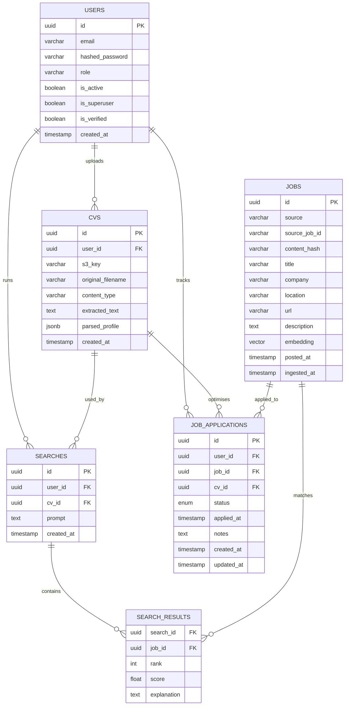

# Data Layer
 
How this application persists and retrieves data. This is the companion to the code-architecture doc, which treats persistence as a seam — here is what lives behind that seam: the ORM models, the repositories that own every query, transaction and session handling, the `pgvector` design, CV storage across Postgres and S3, migrations, and the Pydantic DTO boundary.
 
> Above this layer nothing writes SQL. Routers and services call repositories; repositories are the only place ORM queries and the `pgvector` operators appear. Keeping it that way is what lets the storage schema change without rippling into business logic.

## What lives where
 
Three durable stores, each holding what it's good at:
 
- **PostgreSQL + pgvector** — the single source of truth. Relational data (users, CVs metadata, jobs, searches, results) *and* the job embeddings, in one place. No separate vector database (per ADR-002).
- **S3** — CV files (the binary blobs). Postgres stores only the object *key*, never the bytes.
- **Redis** — cache and ARQ broker. Not durable state — nothing here is a source of truth; it can be flushed and rebuilt.
The data layer itself is three kinds of code: `models/` (SQLAlchemy ORM table definitions), `repositories/` (the only place queries live), and `alembic/` (schema migrations). The S3 byte I/O is a thin integration client (`integrations/s3.py`); the data layer coordinates the *metadata* row that points at the object.

## The data model
 
Eight tables. The key design decision (corrected from the first draft) is the split between a **job posting** — a shared, scraped entity — and a **match result** — a job's relevance *to one particular search*. The posting lives in `jobs`; the result lives in the `search_results` join. A job's score is a fact about a `(search, job)` pair, not about the job, so it belongs on the join. The sixth table, `job_applications`, tracks a user's own application lifecycle for a discovered job — distinct from the system's match results. Two further tables — `generated_documents` and `outreach_emails` — back the document-generation and outreach features (added later; not drawn in the ERD below); see `app/models/`.
 

 
### ORM models (SQLAlchemy 2.0)
 
```python
from datetime import datetime
from uuid import UUID, uuid4
from pgvector.sqlalchemy import Vector
from sqlalchemy import ForeignKey, String, Text, DateTime, UniqueConstraint, func
from sqlalchemy.dialects.postgresql import JSONB
from sqlalchemy.orm import DeclarativeBase, Mapped, mapped_column, relationship
from fastapi_users.db import SQLAlchemyBaseUserTableUUID
 
 
class Base(DeclarativeBase):
    pass
 
 
class User(SQLAlchemyBaseUserTableUUID, Base):
    # fastapi-users supplies: id, email, hashed_password,
    # is_active, is_superuser, is_verified
    __tablename__ = "users"
    role:       Mapped[str] = mapped_column(String, default="user")
    created_at: Mapped[datetime] = mapped_column(DateTime(timezone=True), server_default=func.now())
 
 
class CV(Base):
    __tablename__ = "cvs"
    id:                Mapped[UUID] = mapped_column(primary_key=True, default=uuid4)
    user_id:           Mapped[UUID] = mapped_column(ForeignKey("users.id", ondelete="CASCADE"), index=True)
    s3_key:            Mapped[str]                                  # location in S3, NOT the bytes
    original_filename: Mapped[str]
    content_type:      Mapped[str]
    extracted_text:    Mapped[str | None] = mapped_column(Text)     # filled after parsing
    parsed_profile:    Mapped[dict | None] = mapped_column(JSONB)   # validated CVProfile (see DTOs)
    created_at:        Mapped[datetime] = mapped_column(DateTime(timezone=True), server_default=func.now())
 
 
class Job(Base):
    __tablename__ = "jobs"
    id:            Mapped[UUID] = mapped_column(primary_key=True, default=uuid4)
    source:        Mapped[str] = mapped_column(index=True)          # "adzuna", "indeed"…
    source_job_id: Mapped[str]                                      # id on the origin board
    content_hash:  Mapped[str] = mapped_column(index=True)          # cross-source dedup
    title:         Mapped[str]
    company:       Mapped[str | None]
    location:      Mapped[str | None]
    url:           Mapped[str]                                      # direct apply link (ADR-003)
    description:   Mapped[str] = mapped_column(Text)
    embedding:     Mapped[list[float]] = mapped_column(Vector(768)) # nomic-embed-text
    posted_at:     Mapped[datetime | None] = mapped_column(DateTime(timezone=True))
    ingested_at:   Mapped[datetime] = mapped_column(DateTime(timezone=True), server_default=func.now())
 
    __table_args__ = (UniqueConstraint("source", "source_job_id", name="uq_job_origin"),)
 
 
class Search(Base):
    __tablename__ = "searches"
    id:         Mapped[UUID] = mapped_column(primary_key=True, default=uuid4)
    user_id:    Mapped[UUID] = mapped_column(ForeignKey("users.id", ondelete="CASCADE"), index=True)
    cv_id:      Mapped[UUID | None] = mapped_column(ForeignKey("cvs.id", ondelete="SET NULL"))
    prompt:     Mapped[str] = mapped_column(Text)
    created_at: Mapped[datetime] = mapped_column(DateTime(timezone=True), server_default=func.now())
    results:    Mapped[list["SearchResult"]] = relationship(
        back_populates="search", cascade="all, delete-orphan"
    )
 
 
class SearchResult(Base):
    __tablename__ = "search_results"
    search_id:   Mapped[UUID] = mapped_column(ForeignKey("searches.id", ondelete="CASCADE"), primary_key=True)
    job_id:      Mapped[UUID] = mapped_column(ForeignKey("jobs.id", ondelete="CASCADE"), primary_key=True)
    rank:        Mapped[int]
    score:       Mapped[float]
    explanation: Mapped[str] = mapped_column(Text)
    search:      Mapped["Search"] = relationship(back_populates="results")
    job:         Mapped["Job"] = relationship()


class ApplicationStatus(str, enum.Enum):
    """Lifecycle stages of a single job application.

    Values match the frontend ApplicationStatus type in
    frontend/src/lib/api/applications.ts exactly.
    """
    saved     = "saved"
    applied   = "applied"
    interview = "interview"
    offer     = "offer"
    rejected  = "rejected"


class JobApplication(Base):
    """One row per (user, job) application attempt.

    ``cv_id`` is nullable — a user may save a job before attaching the CV
    they intend to use. The service layer sets ``applied_at`` when the status
    transitions to ``ApplicationStatus.applied``.
    """
    __tablename__ = "job_applications"
    id:         Mapped[UUID]              = mapped_column(primary_key=True, default=uuid4)
    user_id:    Mapped[UUID]              = mapped_column(ForeignKey("users.id", ondelete="CASCADE"), index=True)
    job_id:     Mapped[UUID]              = mapped_column(ForeignKey("jobs.id",  ondelete="CASCADE"), index=True)
    cv_id:      Mapped[UUID | None]       = mapped_column(ForeignKey("cvs.id",   ondelete="SET NULL"), index=True)
    status:     Mapped[ApplicationStatus] = mapped_column(
        Enum(ApplicationStatus, name="applicationstatus"),
        default=ApplicationStatus.saved,
    )
    applied_at: Mapped[datetime | None]   = mapped_column(DateTime(timezone=True))
    notes:      Mapped[str | None]        = mapped_column(Text)
    created_at: Mapped[datetime]          = mapped_column(DateTime(timezone=True), server_default=func.now())
    updated_at: Mapped[datetime]          = mapped_column(
        DateTime(timezone=True), server_default=func.now(), onupdate=func.now()
    )

    __table_args__ = (
        UniqueConstraint("user_id", "job_id", name="uq_application_user_job"),
    )
```
 
A few things worth noting. `jobs` carries no `user_id` or `search_id` — a scraped posting is shared across every user, and a user's relationship to it is always mediated by a search. The composite primary key on `search_results` `(search_id, job_id)` means a job can appear at most once per search. The `parsed_profile` JSONB column lets a structured CV profile live alongside the raw text without a rigid column-per-field schema (and it's validated by a Pydantic model — see [DTOs](#dtos-pydantic-vs-orm-models)).

`job_applications` is the user's side of the story: once a job surfaces in a search the user can save it, apply (attaching the CV they want to be evaluated against), and track the outcome through the `status` ENUM (`saved → applied → interview → offer / rejected`). Values match the frontend `ApplicationStatus` type exactly — the DB ENUM will hard-reject any value it doesn't know, so both sides must stay in sync. The unique constraint `(user_id, job_id)` ensures a single application record per user-job pair — status transitions update that row, not create new ones. `cv_id` is nullable so users can save a job before deciding which CV to use; the service layer fills in `applied_at` when status first becomes `applied`.

## pgvector: the vector column & index
 
The embedding column dimension is bound to the embedding model. With `nomic-embed-text` it is **768**; `text-embedding-3-small` would be 1536. This is not a free knob: changing models means a migration to alter the column *and* re-embedding the entire corpus, because vectors from different models aren't comparable.
 
At a tiny corpus an exact scan is fine, but it's O(n) per query — every search reads the whole table. Once the corpus grows you need an approximate index. pgvector offers `HNSW` (high recall, no tuning, slower build — the sensible default) and `IVFFlat` (faster build, but needs representative data present before building and a tuned `lists` parameter). The index operator class must match the distance you query with — `vector_cosine_ops` pairs with the `<=>` cosine operator. A mismatch silently disables the index, so the query keeps working but slowly. Both the extension and the index are created in a migration (see [Migrations](#migrations-alembic--pgvector)).
 
The similarity query itself lives in the repository and uses SQLAlchemy's pgvector operator:
 
```python
select(Job).order_by(Job.embedding.cosine_distance(query_vector)).limit(20)
```

## Repositories
 
A repository owns the queries for one aggregate. It takes an `AsyncSession`, exposes intention-revealing methods (`search_by_vector`, `upsert_many`, `get_with_results`), and — importantly — **never commits**. It `add`s, `flush`es when it needs a generated id, and reads; the surrounding unit of work commits (see next section). This keeps a multi-step service operation atomic instead of half-committing midway.
 
```python
from sqlalchemy import select, func
from sqlalchemy.dialects.postgresql import insert
from sqlalchemy.ext.asyncio import AsyncSession
from sqlalchemy.orm import selectinload
 
 
class JobRepository:
    def __init__(self, db: AsyncSession):
        self.db = db
 
    async def search_by_vector(self, vector: list[float], limit: int = 20) -> list[Job]:
        res = await self.db.execute(
            select(Job).order_by(Job.embedding.cosine_distance(vector)).limit(limit)
        )
        return list(res.scalars())
 
    async def upsert_many(self, rows: list[dict]) -> None:
        # Idempotent ingest: re-running a scrape must not duplicate jobs.
        # ON CONFLICT against the (source, source_job_id) unique constraint.
        stmt = insert(Job).values(rows)
        stmt = stmt.on_conflict_do_update(
            constraint="uq_job_origin",
            set_={
                "title":       stmt.excluded.title,
                "description": stmt.excluded.description,
                "embedding":   stmt.excluded.embedding,
                "ingested_at": func.now(),
            },
        )
        await self.db.execute(stmt)
 
 
class SearchRepository:
    def __init__(self, db: AsyncSession):
        self.db = db
 
    async def get_with_results(self, search_id: UUID) -> Search | None:
        # selectinload avoids the N+1 that lazy-loading each result + job would cause.
        res = await self.db.execute(
            select(Search)
            .where(Search.id == search_id)
            .options(selectinload(Search.results).selectinload(SearchResult.job))
        )
        return res.scalar_one_or_none()
 
    async def save_search(self, user_id, cv_id, prompt, ranked) -> Search:
        search = Search(user_id=user_id, cv_id=cv_id, prompt=prompt)
        search.results = [
            SearchResult(job_id=m.job_id, rank=i + 1, score=m.score, explanation=m.explanation)
            for i, m in enumerate(ranked)
        ]
        self.db.add(search)
        await self.db.flush()      # populate search.id; commit stays with the caller
        return search
```
 
The `upsert_many` method is where the data layer delivers the idempotency the resilience design depends on: because ARQ delivers at-least-once, a re-run of an ingest task must not create duplicate jobs, and `ON CONFLICT` on the origin-id unique constraint guarantees that.

## Transaction boundaries
 
The request-scoped `AsyncSession` *is* the unit of work. A service method composes several repository calls; they all commit together at the end, or not at all. The dependency commits on success and rolls back on any exception, so services never sprinkle `commit()` calls and repositories never own a transaction:
 
```python
async def get_db() -> AsyncIterator[AsyncSession]:
    async with async_session_factory() as session:
        try:
            yield session
            await session.commit()
        except Exception:
            await session.rollback()
            raise
```
 
In an ARQ worker the pattern is identical but per task: open a session, do the work, commit, close — one task is one transaction. Don't reuse a session across tasks, and don't keep one open for the lifetime of the worker.

## Sessions & async correctness
 
The engine and session factory are async end to end (`asyncpg` under SQLAlchemy's async engine). A stray synchronous driver anywhere reintroduces event-loop blocking.
 
```python
from sqlalchemy.ext.asyncio import create_async_engine, async_sessionmaker
 
engine = create_async_engine(settings.DATABASE_URL, pool_size=10, max_overflow=5, pool_pre_ping=True)
async_session_factory = async_sessionmaker(engine, expire_on_commit=False)
```
 
Three rules that prevent the most common production stalls:
 
- **One session per request, one per task.** An `AsyncSession` is not safe to share across concurrent coroutines. Never pass one session into several `asyncio.gather(...)` branches — give each its own, or run them sequentially on the one session.
- **`expire_on_commit=False`.** Without it, accessing an attribute after commit triggers a lazy reload, which in async code raises (there's no implicit I/O). Setting it false lets you return objects after the commit.
- **Size the pools against Postgres.** Total connections = web `pool_size` + (worker `pool_size` × worker replicas), and that must stay under Postgres `max_connections`. Default pools exhaust a small database fast once you scale workers, so pick the numbers deliberately and add `pool_pre_ping` to drop dead connections.
 
## CV storage: Postgres + S3
 
CVs are binary files and sensitive personal data, so they get the classic split: **bytes in S3, metadata in Postgres.** The `cvs` row holds the S3 key, the original filename, the extracted text, and the parsed profile; the object itself sits in a private, encrypted bucket. Postgres never stores the file content.
 
**Upload flow.** The service validates the upload (content type sniffed from the bytes, not trusted from the extension; a hard size cap), generates its own key — never the user's filename — like `cvs/{user_id}/{uuid}.pdf`, `put`s the object to a private bucket with server-side encryption, then inserts the `cvs` row. Parsing (extract text → structured profile) is CPU-bound and runs off the request — in a worker or a thread — and updates `extracted_text` and `parsed_profile` on the row when done.
 
**Retrieval.** Never serve the bucket publicly. The integration client mints a short-lived presigned GET URL on demand; the `cvs` row's `s3_key` is what it signs.
 
**Consistency between the two stores.** S3 and Postgres can't share a transaction, so order matters: write the S3 object first, then the DB row — if the DB insert fails, a dangling object is cheap to sweep later; the reverse (a row pointing at a missing object) is a broken reference the app will trip over. On failure mid-flight, clean up the orphan.
 
**Deletion is the part people miss.** The `ondelete="CASCADE"` on `cvs.user_id` removes the *rows* when a user is deleted, but it cannot touch S3 — a database cascade has no reach into object storage. Deleting a user (a GDPR erasure request) must explicitly: gather that user's `s3_key`s, delete those objects from S3, then delete the rows. Wire this into the user-deletion service or it will silently leave personal data in the bucket forever.
 
The division of labor: `integrations/s3.py` does the byte I/O (`put`, `presign`, `delete`); the `CVRepository` owns the `cvs` row; a service coordinates the two so they stay in sync.

## Migrations (Alembic + pgvector)
 
Schema changes are versioned with Alembic, run as a one-off command (`alembic upgrade head`) — never baked into app startup, so two app instances can't race to migrate.
 
The async setup needs `env.py` to run migrations through the async engine (via `connection.run_sync`), and `target_metadata = Base.metadata` with **every model imported** so autogenerate sees the full schema. Two pgvector-specific gotchas:
 
- **Import the pgvector types in `env.py`** (`from pgvector.sqlalchemy import Vector`) or autogenerate emits broken column definitions for the embedding column.
- **`CREATE EXTENSION` and the vector index are not autogenerated.** Alembic can't infer them from the models, so write them by hand. The extension must be created before any table with a `Vector` column.
```python
def upgrade() -> None:
    op.execute("CREATE EXTENSION IF NOT EXISTS vector")
    # ... autogenerated op.create_table(...) calls (verify the Vector column type) ...
    op.execute(
        "CREATE INDEX ix_jobs_embedding ON jobs "
        "USING hnsw (embedding vector_cosine_ops)"
    )
```
 
Always read an autogenerated migration before applying it — autogenerate misses server defaults, some constraint changes, and (here) anything pgvector-related.

## DTOs: Pydantic vs ORM models
 
There are two parallel model families and they must not be confused. **ORM models** describe the storage shape and stay inside the data layer. **Pydantic DTOs** describe the API boundary shape. Returning an ORM object straight from an endpoint leaks internal columns (the embedding vector, the S3 key) and couples the public contract to the database — so endpoints declare a `response_model` and the conversion happens explicitly.
 
Pydantic v2 reads from ORM objects with `from_attributes`:
 
```python
from pydantic import BaseModel, ConfigDict
 
class JobRead(BaseModel):                 # public view of a posting — no embedding, no hash
    model_config = ConfigDict(from_attributes=True)
    id: UUID
    title: str
    company: str | None
    location: str | None
    url: str
 
class JobMatch(BaseModel):                # a search result for the API: posting + per-match data
    job: JobRead
    rank: int
    score: float
    explanation: str
 
class SearchCreate(BaseModel):            # request body
    cv_id: UUID
    prompt: str
 
class CVUploadResponse(BaseModel):        # never exposes s3_key
    model_config = ConfigDict(from_attributes=True)
    id: UUID
    original_filename: str
    created_at: datetime
```
 
Assembling the response from a loaded `SearchResult` row is then mechanical:
 
```python
JobMatch(
    job=JobRead.model_validate(r.job),
    rank=r.rank, score=r.score, explanation=r.explanation,
)
```
 
One neat symmetry: the `CVProfile` schema used to validate the LLM's structured extraction is the *same* schema that (de)serializes the `parsed_profile` JSONB column — Pydantic validates it on the way in, you store `profile.model_dump()`, and `CVProfile.model_validate(row.parsed_profile)` reads it back. The schema is the contract for both the model output and the stored shape.
 
Two columns must never appear in any response DTO: `Job.embedding` (large, internal, meaningless to clients) and `CV.s3_key` (an internal storage location — clients get a presigned URL instead).

## Indexes & constraints
 
| Table | Constraint / index | Purpose |
|---|---|---|
| `jobs` | unique `(source, source_job_id)` | idempotent ingest / dedup |
| `jobs` | index on `content_hash` | cross-source dedup lookups |
| `jobs` | HNSW on `embedding` (`vector_cosine_ops`) | fast similarity search |
| `search_results` | composite PK `(search_id, job_id)` | a job appears once per search |
| `searches` | index on `user_id` | list a user's searches |
| `cvs` | index on `user_id` | list / cascade a user's CVs |
| `job_applications` | unique `(user_id, job_id)` | one application record per user-job pair |
| `job_applications` | index on `user_id` | list / filter a user's applications |
| `job_applications` | index on `job_id` | look up all applicants for a job |
| `job_applications` | index on `cv_id` | find applications linked to a CV (SET NULL safe) |
| FKs | `ondelete=CASCADE` (user→cvs/searches/applications), `SET NULL` (application→cv, search→cv) | clean deletion, no orphan rows |

## Testing the data layer
 
Repository tests run against a **real** Postgres with pgvector — not a mock and not SQLite, because the whole point is exercising `pgvector` queries, the unique-constraint upsert, and the migrations. Use Testcontainers with the `pgvector/pgvector` image (or a CI service container), apply migrations to a fresh database, and wrap each test in a transaction that rolls back afterward for isolation. Mocking the database belongs in *service* tests, where the repository is the seam you swap; for the data layer itself, hitting real Postgres is the test.
 