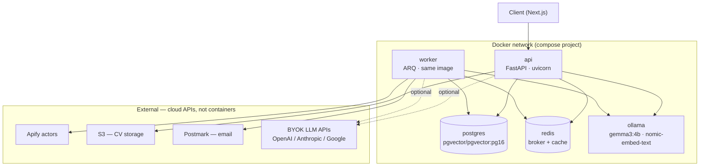

# Docker Orchestration 

One of the most crucial aspects of this application is to ensure proper orchestration of multiple services and integrations such as: Postgres(with `pgvector`), FastAPI backend, Ollama model(with embedding model), Redis and other parts of the system. Docker provides a straightforward way to manage these and run each service in a separate container. The API and worker share a single Dockerfile and codebase; what separates them is the entrypoint command (`uvicorn` for the API, `arq` for the worker). Cloud dependencies — Apify, S3, Postmark, and the optional BYOK inference APIs — are not containers; they are external services reached via environment variables and not part of the Compose topology.

## Container Topology



## Services 

### Api
 
The FastAPI application serving the HTTP request path. Built from the project's shared multi-stage Dockerfile and started with `uvicorn`.
 
### Worker
 
The ARQ background worker handling scraping, embedding, AI analysis, and email dispatch. Runs the same image as `api` with a different entrypoint: `arq app.workers.settings.WorkerSettings`. Keeping it as a separate container preserves the crash-domain isolation described in [code architecture](./code-architecture.md) — a worker failure does not take down the API, and the two can scale independently.
 
### Postgres/pgvector
 
Uses `pgvector/pgvector:pg16` rather than the plain `postgres` image, which ships the `vector` extension. The extension is enabled via an early Alembic migration (`CREATE EXTENSION IF NOT EXISTS vector`) so it is tracked alongside the rest of the schema. Data is persisted via a named volume so the job index survives `docker compose down`.
 
### Redis
 
A single Redis instance serves both roles in the stack: the ARQ job broker and the application cache. No need to split them at this scale.
 
### Ollama
 
Runs the local inference stack — `gemma3:4b` for all LLM tasks and `nomic-embed-text` for embeddings. Models are persisted via a named volume mounted at `/root/.ollama`; without it, every container recreate re-downloads several gigabytes. Models are pulled on first boot via an entrypoint script.
 
`gemma3:4b` requires roughly 4–6 GB of memory to run comfortably. The ingestion path is inference-heavy — it embeds the full job corpus and runs AI analysis per posting — so CPU-only throughput will be a bottleneck. If the host has a GPU, pass it through via `deploy.resources.reservations.devices` in the Compose file.
 
## Startup Order and Healthchecks
 
`depends_on` alone waits for a container to start, not for the service inside it to be ready. `postgres`, `redis`, and `ollama` each define a healthcheck; `api` and `worker` use `depends_on: condition: service_healthy` so they do not attempt to connect before their dependencies are accepting traffic.
 
The Ollama healthcheck must confirm that the target models are loaded and responding — not just that the process is alive. The process starts before model loading completes, so a naive HTTP ping on port 11434 passes too early. Poll `/api/tags` and check that `gemma3:4b` and `nomic-embed-text` appear in the response.
 
## Volumes
 
| Volume | Mounted at | Purpose |
|---|---|---|
| `postgres_data` | `/var/lib/postgresql/data` | Persists the database across restarts |
| `ollama_data` | `/root/.ollama` | Persists pulled models across restarts |
 
## Migrations
 
Alembic migrations run as a one-off command, not baked into the API startup:
 
```bash
docker compose run --rm api alembic upgrade head
```
 
Run this after first boot and after any schema change before restarting the API and worker.
 
## Dev vs Production
 
A Compose override file (`docker-compose.override.yml`) handles local development without touching the base configuration:
 
- Bind-mounts the source directory into the `api` container for hot reload
- Runs `uvicorn` with `--reload`
- May expose additional ports for direct database or Redis access
The base `docker-compose.yml` targets production and uses the built image with no mounts.
 

